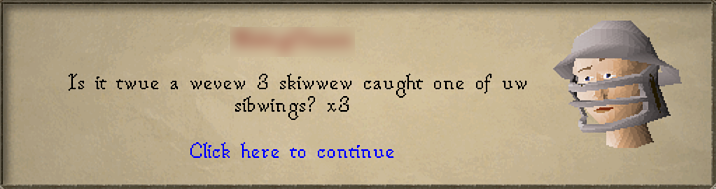
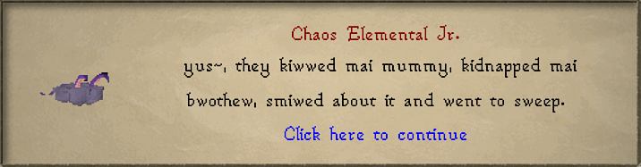
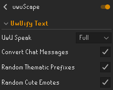

# UwUScape
It's exactly what it sounds like! Replaces various ingame texts with uwuified versions, for the true anime experience.
I basically took Idyl's plugin he made for a meme video, and fleshed it out. For now this only converts overhead text, chat messages and dialogue.  
  
  
## Settings
This Plugin comes with a couple of settings:  
  
- uwu speak: You can either turn it off, have it on fully, or have a light version which doesn't convert all l's and r's into w, but still uwuifies some things.
- Convert Chat Messages: This converts all chat messages from players into uwu versions. This effect is purely for the user's client.
- random thematic prefixes: This enables prefixes like the example "teehee" to randomly show up in phrases.
- Random cute Emotes: This randomly adds fitting emotes to the ends of messages.